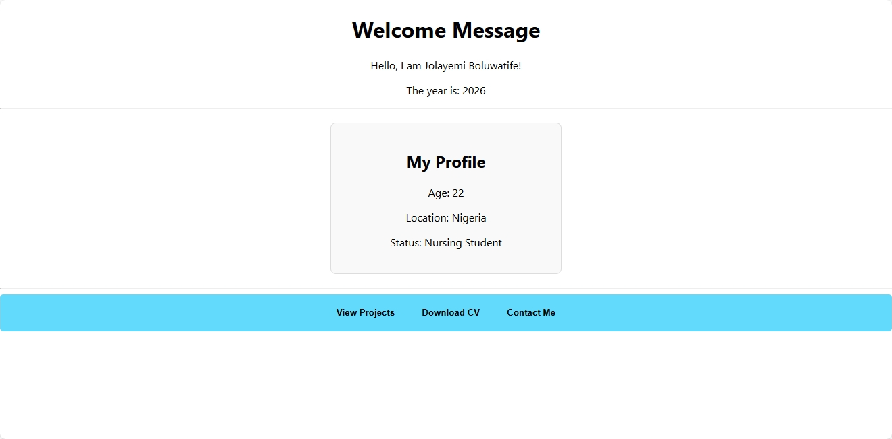

# My First React App: From Nursing to Tech

This project is a major milestone in my journey as a student at the University of Medical Sciences (UNIMED). While I am focused on my nursing and midwifery studies, I am also developing my skills in web development. This app is my first hands-on practice with React components.

## Project Overview
This application is a "Basic Components Practice" assignment focused on creating a reusable user interface.

### Components Developed:
* **Greeting Component**: Displays a personalized welcome message using my name and the current year (2026) via JavaScript.
* **Profile Component**: Showcases my status as a Nursing Student and my location in Nigeria.
* **Reusable Button**: I created a single button component and used it three times with different labels: "View Projects", "Download CV", and "Contact Me".

## Prerequisite Knowledge (Part 1)
Before building this app, I answered several key JavaScript questions regarding Arrow Functions, Destructuring, and the Map method. These concepts are the foundation of this project and can be found in the `answers.txt` file in this repository.

## Final Output
Below is the rendered application:

